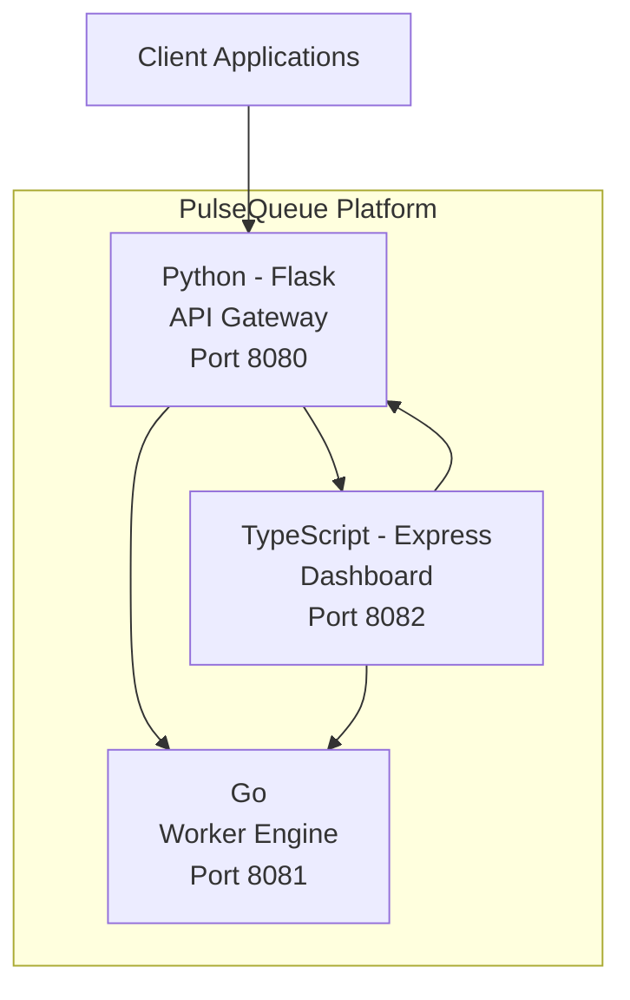

# PulseQueue

A lightweight multi-service job queue management platform. PulseQueue provides a simple yet powerful API for creating, managing, and processing asynchronous jobs with priority-based scheduling.

## Architecture



## Services

| Service | Language | Port | Description |
|---------|----------|------|-------------|
| API Gateway | Python (Flask) | 8080 | REST API for job CRUD operations |
| Worker Engine | Go | 8081 | High-performance job processing engine |
| Dashboard | TypeScript (Express) | 8082 | Monitoring and management interface |

## Quick Start

### Prerequisites

- Docker & Docker Compose
- Make (optional, for shortcuts)

### Run with Docker Compose

```bash
# Start all services
make up
# or
docker compose up -d --build

# Check health
make health

# View logs
make logs

# Stop services
make down
```

### Local Development

```bash
# Run all tests
make test

# Run linting
make lint
```

## API Reference

### API Gateway (Port 8080)

#### Health Check
```
GET /health
```
Response:
```json
{"status": "healthy", "service": "api-gateway", "timestamp": "2026-01-01T00:00:00"}
```

#### Create Job
```
POST /jobs
Content-Type: application/json

{
  "task": "send_email",
  "priority": "high",
  "payload": {"to": "user@example.com", "subject": "Hello"}
}
```
Priority levels: `low`, `normal`, `high`, `critical`

#### List Jobs
```
GET /jobs
GET /jobs?status=queued
```

#### Get Job
```
GET /jobs/{job_id}
```

#### Cancel Job
```
POST /jobs/{job_id}/cancel
```

### Worker Engine (Port 8081)

#### Health Check
```
GET /health
```

#### Submit Job for Processing
```
POST /submit
Content-Type: application/json

{"id": "uuid", "task": "send_email", "priority": "high", "payload": {}}
```

#### Check Job Status
```
GET /status?id={job_id}
```

#### Worker Stats
```
GET /stats
```

### Dashboard (Port 8082)

#### Health Check
```
GET /health
```

#### Service Overview
```
GET /api/overview
GET /api/services
GET /api/config
```

## Environment Variables

See `.env.example` for all available configuration options.

| Variable | Default | Description |
|----------|---------|-------------|
| API_PORT | 8080 | API Gateway listen port |
| WORKER_PORT | 8081 | Worker Engine listen port |
| DASHBOARD_PORT | 8082 | Dashboard listen port |
| WORKER_URL | http://worker-engine:8081 | Worker service URL |
| API_GATEWAY_URL | http://api-gateway:8080 | API Gateway URL |
| LOG_LEVEL | INFO | Logging level (DEBUG, INFO, WARNING, ERROR) |
| NODE_ENV | development | Node environment |

## Testing

```bash
# All tests
make test

# Individual services
make test-python    # API Gateway tests
make test-go        # Worker Engine tests
make test-ts        # Dashboard tests

# Linting
make lint
```

## CI/CD

GitHub Actions workflow runs on push/PR to main:
- Python: flake8 lint + pytest
- Go: go test
- TypeScript: eslint + jest
- Docker Compose build verification

> **Note:** The `.github/workflows/ci.yml` file may need to be manually added after initial repository setup due to GitHub API restrictions.

## Project Structure

```
pulsequeue/
├── api-gateway/          # Python Flask API service
│   ├── app.py
│   ├── requirements.txt
│   ├── Dockerfile
│   └── tests/
├── worker-engine/        # Go worker service
│   ├── main.go
│   ├── main_test.go
│   ├── go.mod
│   └── Dockerfile
├── dashboard/            # TypeScript Express service
│   ├── src/
│   ├── package.json
│   ├── tsconfig.json
│   ├── Dockerfile
│   └── jest.config.js
├── docker-compose.yml
├── Makefile
├── .env.example
├── .gitignore
└── README.md
```

## License

MIT
